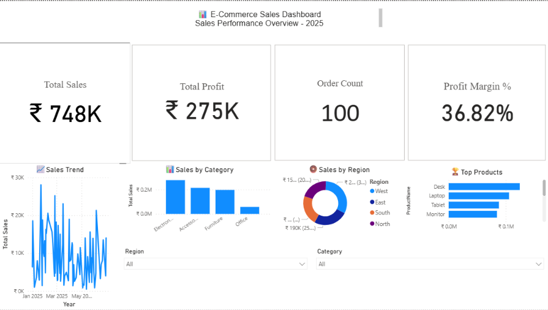

# E-Commerce Sales Dashboard

An interactive **E-Commerce Sales Dashboard** built using **Microsoft Power BI** to analyze sales performance, profitability, orders, customers, and products.

## 📊 Project Overview

This project demonstrates the use of **Power Query, DAX, data modeling, and interactive Power BI visualizations** to transform raw e-commerce data into an analytical dashboard.

The dashboard provides insights into key business metrics and helps identify sales and profitability trends across different products, customers, and regions.

## 🛠️ Tools & Technologies

* **Power BI** – Dashboard development and data visualization
* **Power Query** – Data cleaning and transformation
* **DAX** – Calculated measures and business metrics
* **Microsoft Excel** – Source dataset
* **Data Modeling** – Relationships between Sales, Customers, and Products

## 📁 Dataset

The project uses an Excel dataset containing three main tables:

* **Sales** – Transaction and sales-related information
* **Customers** – Customer-related information
* **Products** – Product and category information

The dataset was imported into Power BI and transformed using Power Query before building the analytical model.

## 🔄 Data Preparation

The following steps were performed using Power Query:

1. Imported the Excel dataset into Power BI.
2. Examined the structure and data types of the tables.
3. Cleaned and transformed the source data.
4. Prepared the Sales, Customers, and Products tables.
5. Created relationships between the tables.
6. Built a structured data model for analysis.

## 📐 DAX Measures

Key DAX measures created for the dashboard include:

```DAX
Total Sales = SUM(Sales[Sales])

Total Profit = SUM(Sales[Profit])

Total Quantity = SUM(Sales[Quantity])

Order Count = DISTINCTCOUNT(Sales[Order ID])

Profit Margin = DIVIDE([Total Profit], [Total Sales], 0)
```

These measures are used to calculate and display the dashboard's primary business KPIs.

## 📈 Dashboard Features

The dashboard provides an interactive view of:

* Total Sales
* Total Profit
* Total Quantity
* Order Count
* Profit Margin
* Sales performance
* Profitability analysis
* Product-level analysis
* Customer-level analysis
* Regional analysis
* Interactive filtering using slicers

## 🧩 Data Model

The dashboard uses a relational data model connecting:

```text
Customers
    │
    │
    ▼
  Sales
    ▲
    │
    │
 Products
```

The **Sales** table acts as the central transactional table, while **Customers** and **Products** provide additional dimensions for analysis.

## 📷 Dashboard Preview



## 🚀 How to Use

1. Clone or download this repository.
2. Open `E-Commerce Sales Dashboard.pbix` using **Microsoft Power BI Desktop**.
3. If required, update the dataset path in Power Query.
4. Refresh the data.
5. Explore the dashboard using the available filters and visualizations.

## 🎯 Key Learning Outcomes

Through this project, I practiced:

* Data cleaning and transformation using Power Query
* Building relationships between tables
* Designing a structured Power BI data model
* Creating DAX measures
* Developing interactive dashboards
* Using KPIs and business-oriented visualizations
* Analyzing sales and profitability data

## 👨‍💻 Author

**Sciddhanto Sinha**

B.Tech – Computer Science Engineering (AI & Analytics)

[LinkedIn](https://www.linkedin.com/in/sciddhanto-sinha-2036a6264) • [GitHub](https://github.com/SciddhantoSinha)
